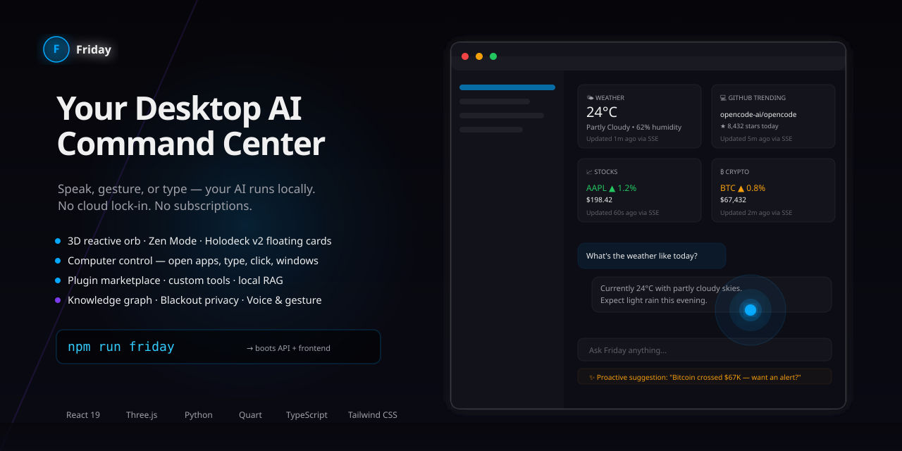
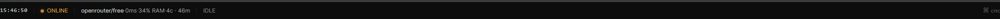
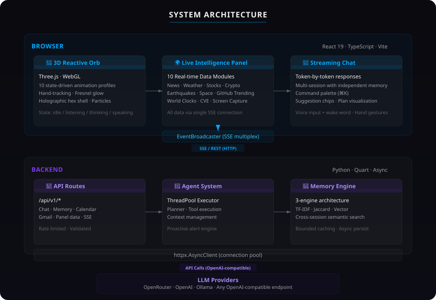

<div align="center">
  <a name="readme-top"></a>

  

  <br>

  <h1 align="center"><code>Friday</code> — Votre Centre de Commande IA de Bureau</h1>

  <p align="center">
    <b>Une IA open source de classe JARVIS qui fonctionne entièrement sur votre matériel.</b><br>
    Parlez · Faites des gestes · Tapez — elle voit votre écran, contrôle votre ordinateur, exécute des automatisations,<br>
    visualise les données en 3D et répond avec de la personnalité. Aucune dépendance au cloud. Aucun abonnement.
  </p>

  <!-- Badges du héros -->
  <p align="center">
    <a href="https://github.com/alimaandev/Friday/releases"></a>
    <a href="https://github.com/alimaandev/Friday/stargazers"></a>
    <a href="https://github.com/alimaandev/Friday/issues"></a>
    <a href="https://github.com/alimaandev/Friday/actions"></a>
    <a href="https://github.com/alimaandev/Friday/blob/main/LICENSE"></a>
    <br>
    <a href="https://react.dev"></a>
    <a href="https://threejs.org"></a>
    <a href="https://www.python.org"></a>
    <a href="https://vite.dev"></a>
    <a href="https://tailwindcss.com"></a>
    <a href="https://www.typescriptlang.org"></a>
  </p>

  <p align="center">
    <a href="https://github.com/sponsors/alimaandev"></a>
    <a href="#"></a>
    <a href="https://twitter.com/intent/tweet?text=Check%20out%20Friday%20-%20The%20Open-Source%20JARVIS%20for%20Your%20Desktop&url=https://github.com/alimaandev/Friday"></a>
    <a href="https://www.youtube.com/@alimaandev"></a>
  </p>

  <p align="center">
    <b><a href="README.md">English</a></b>
    ·
    <b><a href="README.ur.md">اردو</a></b>
    ·
    <b><a href="README.hi.md">हिन्दी</a></b>
    ·
    <b><a href="README.es.md">Español</a></b>
    ·
    <b>Français</b>
  </p>
</div>

<br>

<details>
  <summary><kbd>📖 Table des Matières</kbd></summary>

  - [🤔 Pourquoi Friday ?](#-pourquoi-friday-)
  - [🎬 Démo](#-démo)
  - [⚡ Démarrage Rapide](#-démarrage-rapide)
  - [🚀 Fonctionnalités](#-fonctionnalités)
  - [🔒 Confidentialité et Sécurité](#-confidentialité-et-sécurité)
  - [📁 Structure du Projet](#-structure-du-projet)
  - [⚙️ Configuration](#configuration)
  - [🏗 Architecture](#-architecture)
  - [🛠 Développement](#-développement)
  - [❓ FAQ](#-faq)
  - [🛣 Feuille de Route](#-feuille-de-route)
  - [🤝 Contributions](#-contributions)
  - [⭐ Historique des Étoiles](#-historique-des-étoiles)
  - [💖 Soutien](#-soutien)
  - [📄 Licence](#-licence)

</details>

<br>

---

## 🎯 Votre Centre de Commande IA de Bureau

**Friday** est une IA open source de classe JARVIS qui vit sur votre bureau. Parlez-lui, faites-lui des gestes ou tapez — elle voit votre écran, contrôle votre ordinateur, exécute des automatisations, visualise les données en 3D et répond avec de la personnalité. Tout fonctionne en local. Votre clé API, votre LLM, vos règles.

> L'orbe 3D réagit à votre voix. Le panneau d'Intelligence diffuse 10 sources de données en direct. Le Holodeck rend vos métriques sous forme de barres 3D animées. Le mode Zen transforme tout en orbe monochrome + chat. Et tout commence par une seule commande.

```bash
npm run friday        # → démarre le serveur API + le frontend ensemble (Windows)
# ou
docker compose up -d  # → Frontend : http://localhost:5173 · Backend : http://localhost:8080
```

<br>

---

## ✨ Nouveautés de la v4 — "L'Orbe"

<table>
  <tr>
    <td width="50%" valign="top">
      <p align="center"><strong>🧘 Mode Zen</strong></p>
      <p align="center">
        Une interface minimaliste radicale — un orbe monochrome + chat par défaut. ⌘B bascule
        vers le tableau de bord complet. Des widgets flottants ambiants orbitent autour de l'orbe ;
        survolez ou faites glisser pour les agrandir.
      </p>
    </td>
    <td width="50%" valign="top">
      <p align="center"><strong>🖥️ Contrôle de l'Ordinateur</strong></p>
      <p align="center">
        Ouvrez des applications, concentrez les fenêtres, tapez, cliquez et résumez votre bureau.
        « Organise mon bureau » est un objectif du pilote automatique — chaque action demande d'abord
        votre confirmation.
      </p>
    </td>
  </tr>
  <tr>
    <td width="50%" valign="top">
      <p align="center"><strong>🧩 Marketplace de Plugins</strong></p>
      <p align="center">
        Installez et supprimez des plugins communautaires depuis les Paramètres. Livré avec des
        intégrations pour l'écran, l'e-mail, le calendrier, le web et le système — plus un registre
        communautaire de plugins.
      </p>
    </td>
    <td width="50%" valign="top">
      <p align="center"><strong>🛠 Créateur d'Outils Personnalisés</strong></p>
      <p align="center">
        Décrivez un outil en langage naturel et Friday le génère, l'enregistre et le persiste —
        sans écrire de code.
      </p>
    </td>
  </tr>
  <tr>
    <td width="50%" valign="top">
      <p align="center"><strong>📚 Pipeline RAG Local</strong></p>
      <p align="center">
        Ingérez des documents et recherchez-les avec un découpage aligné sur les phrases + un
        re-ranking lexical par-dessus vos trois moteurs de mémoire parallèles.
      </p>
    </td>
    <td width="50%" valign="top">
      <p align="center"><strong>🧠 Graphe de Connaissances</strong></p>
      <p align="center">
        Entités et relations extraites de vos conversations. Chaque nouvelle session sème le contexte
        à partir du graphe + du journal — « La dernière fois, tu travaillais sur… »
      </p>
    </td>
  </tr>
  <tr>
    <td width="50%" valign="top">
      <p align="center"><strong>🚫 Mode Blackout</strong></p>
      <p align="center">
        Un interrupteur pour la confidentialité totale : outils réseau bloqués, Ollama local forcé,
        sceau PRIVÉ sur l'orbe.
      </p>
    </td>
    <td width="50%" valign="top">
      <p align="center"><strong>⚡ Démarrage en Une Commande</strong></p>
      <p align="center">
        <code>python main.py --ui</code> ou <code>npm run friday</code> démarre l'API + le frontend
        ensemble et ouvre votre navigateur. Le <code>Ctrl+Alt+F</code> global convoque Friday depuis
        n'importe où.
      </p>
    </td>
  </tr>
</table>

<br>

---

## 🤔 Pourquoi Friday ?

**Les assistants cloud sont pratiques — et c'est le problème.** Ils vivent derrière un site web, possèdent votre historique de conversations, téléversent votre écran à la demande vers un fournisseur que vous n'avez pas choisi et facturent un abonnement pour des fonctionnalités que vous pourriez exécuter vous-même.

**Friday est l'alternative qui vous rend le contrôle :**

- 🖥️ **D'abord le bureau** — il fonctionne là où vous travaillez. Pas d'onglet requis, pas de moments « désolé, je ne peux faire ça que dans le cloud ».
- 🔑 **Apportez votre propre LLM** — branchez OpenRouter, OpenAI, Ollama ou n'importe quel endpoint compatible OpenAI. Votre clé, votre fournisseur, votre facturation, vos règles. Aucun serveur Friday n'existe — il n'y a rien à vous facturer.
- 🔒 **Local par conception** — la mémoire, les définitions d'automatisations et les jetons Google vivent dans un dossier `memory_store/` sur *votre* machine, pas dans la base de données de quelqu'un d'autre. Voir [Confidentialité et Sécurité](#-confidentialité-et-sécurité).
- 🎭 **Une personnalité, pas un chatbot** — trois personnalités vocales, conversation ambiante et un orbe 3D qui réagit à vous. On *ressent* un compagnon, car c'est tout l'intérêt.
- 🧩 **Extensible** — plugins, outils personnalisés et un planificateur qui décompose les grands objectifs en étapes exécutées. Si vous pouvez l'écrire en script, Friday peut l'exécuter.

> **L'argument en une phrase :** Friday est un assistant IA de classe JARVIS que vous possédez vraiment — gratuit, open source (MIT) et fonctionnant entièrement sur votre matériel.

<div align="right">
  <a href="#readme-top">▲ retour en haut</a>
</div>

<br>

---

## 🎬 Démo


> 🎥 *Une courte démonstration GIF/vidéo de l'orbe, de la voix et du Holodeck arrive bientôt. En attendant, le tableau de bord ci-dessus montre l'interface complète — et la meilleure démo, c'est de l'exécuter vous-même (30 secondes, plus bas).*

<div align="right">
  <a href="#readme-top">▲ retour en haut</a>
</div>

<br>

---

## ⚡ Démarrage Rapide

### 🚀 Commande unique (recommandé)

```bash
git clone https://github.com/alimaandev/Friday.git
cd Friday
cp config/providers.toml.example config/providers.toml
# Modifiez config/providers.toml — collez votre clé API OpenRouter (ou autre)
npm run friday        # démarre le serveur API + le frontend, ouvre votre navigateur
```

### 🐳 Docker

```bash
git clone https://github.com/alimaandev/Friday.git
cd Friday
cp config/providers.toml.example config/providers.toml
# Modifiez config/providers.toml — collez votre clé API
docker compose up -d
```

### 🔧 Installation manuelle

```bash
git clone https://github.com/alimaandev/Friday.git
cd Friday
pip install -r requirements.txt
cp config/providers.toml.example config/providers.toml
# Modifiez config/providers.toml — collez votre clé API
cd desktop && python api_server.py &
cd .. && npm install && npm run dev
```

<div align="right">
  <a href="#readme-top">▲ retour en haut</a>
</div>

<br>

---

## 🚀 Fonctionnalités

<div align="center">
  <table>
    <tr>
      <td width="50%" valign="top">
        <p align="center">
          
          <br>
          <strong>🎨 Orbe 3D Réactif + Holodeck</strong>
        </p>
        <p align="center">
          Orbe procédural Three.js avec 10 profils d'animation pilotés par l'état. Plus un canevas complet de visualisation de données 3D — barres de métriques animées, champs de particules ambiants, anneaux orbitaux. La caméra suit les gestes de la main en temps réel.
        </p>
      </td>
      <td width="50%" valign="top">
        <p align="center">
          
          <br>
          <strong>🌍 Panneau d'Intelligence en Direct</strong>
        </p>
        <p align="center">
          10 modules de données en temps réel : Actualités, Météo, Actions, Crypto, GitHub, Séismes, Espace, Horloges Mondiales, CVE, Écran. Tout est poussé via une seule connexion SSE — a remplacé 18 boucles de sondage.
        </p>
      </td>
    </tr>
    <tr>
      <td width="50%" valign="top">
        <p align="center">
          
          <br>
          <strong>💬 Chat en Streaming + Personnalité Vocale</strong>
        </p>
        <p align="center">
          Réponses token par token avec visualisation du plan et suivi des appels d'outils. Trois personnalités vocales (JARVIS, FRIDAY, Cortana) avec débit/hauteur TTS uniques et prompts système personnalisés. Changez à tout moment via les paramètres ou ⌘K.
        </p>
      </td>
      <td width="50%" valign="top">
        <p align="center">
          
          <br>
          <strong>🎤 Voix, Gestes et Mode Ambiant</strong>
        </p>
        <p align="center">
          Entrée/sortie vocale avec mot de réveil « Hey Friday » (hors ligne, dans le navigateur). Mode de conversation ambiant — allers-retours naturels avec envoi automatique en pause. Contrôle gestuel par webcam — paume ouverte pour parler, poing pour envoyer. Multilingue (anglais, hindi, ourdou).
        </p>
      </td>
    </tr>
    <tr>
      <td width="50%" valign="top">
        <p align="center">
          <br>
          <strong>⏰ Automatisations</strong>
        </p>
        <p align="center">
          Planifiez des actions récurrentes avec des expressions cron (« tous les jours ouvrés à 9h »). Création en langage naturel — dites « crée une automatisation pour le briefing quotidien à 8h ». Le moteur en arrière-plan vérifie toutes les 30 s et déclenche via SSE. Activez, déclenchez manuellement ou supprimez depuis le panneau d'Intelligence.
        </p>
      </td>
      <td width="50%" valign="top">
        <p align="center">
          <br>
          <strong>👁 Vision Écran et Caméra</strong>
        </p>
        <p align="center">
          Analysez votre écran ou le flux de votre webcam via la vision LLM. Demandez « qu'y a-t-il sur mon écran ? » pour une description instantanée. Le push SSE en arrière-plan décrit automatiquement les changements d'écran. OCR optionnel via pytesseract. Capturez des images de caméra depuis les boutons du panneau d'Intelligence.
        </p>
      </td>
    </tr>
  </table>
</div>

### 🔌 Intégrations

| Intégration | Type | Détails |
|-------------|------|---------|
| **Google Calendar** | OAuth 2.0 | Voir les événements à venir en ligne |
| **Gmail** | OAuth 2.0 | Compteur de non-lus + aperçu de la boîte de réception |
| **Memory** | TF-IDF + Jaccard + Vector | Recherche sémantique entre sessions |
| **Knowledge Graph** | Entity/relation extraction | Continuité de session + connexions proactives |
| **Local RAG** | Chunking + reranking | Ingest de documents + récupération sémantique |
| **Computer Control** | pyautogui + pywin32 | Ouvrir des applications, taper, cliquer, fenêtres, résumé du bureau |
| **Plugin Marketplace** | Manifest registry | Installer/supprimer des plugins communautaires |
| **Custom Tools** | Natural-language builder | Définitions d'outils persistantes, sans code |
| **Proactive Alerts** | SSE | Anomalies système, rappels, notifications |
| **LLM Providers** | Pluggable | OpenRouter, OpenAI, Ollama, Anthropic, personnalisé |
| **Morning Pulse Briefing** | Template | Résumé quotidien météo, actualités, crypto, calendrier, e-mail |
| **Automations Engine** | Cron + SSE | Déclencheurs conditionnels avec planificateur en arrière-plan |
| **Vision** | LLM + PIL | Capture d'écran, images de caméra, OCR optionnel |

<div align="right">
  <a href="#readme-top">▲ retour en haut</a>
</div>

<br>

---

## 🔒 Confidentialité et Sécurité

Friday est conçu pour que *vos données restent les vôtres*. Voici exactement ce qui leur arrive — sans aucune petite ligne.

### Où vivent vos données

| Donnée | Emplacement | Notes |
|------|----------|-------|
| **Clés API** | `config/providers.toml` | Lues uniquement par Friday pour appeler le fournisseur que *vous* avez configuré. Jamais téléversées où que ce soit. |
| **Mémoire des conversations** | `memory_store/long_term.json` | JSON brut sur votre disque — facile à inspecter, sauvegarder ou supprimer. |
| **Index vectoriel / embeddings** | `memory_store/vector_store.pkl`, `embeddings.pkl` | Index de recherche locaux pour le rappel sémantique. |
| **Jetons OAuth Google** | `memory_store/` | Stockés localement après votre autorisation de Calendar/Gmail. |
| **Outils personnalisés** | `memory_store/custom_tools.json` | Les définitions d'outils que vous construisez restent sur votre machine. |
| **État Blackout** | `memory_store/blackout.json` | L'état de l'interrupteur de confidentialité est persisté localement. |

### Ce qui quitte votre machine

- **Uniquement les appels à votre fournisseur LLM configuré** (OpenRouter, OpenAI, Ollama, etc.) — et uniquement le contenu que vous demandez à Friday de traiter. Si vous exécutez Ollama en local, **rien** de lié à l'IA ne quitte votre machine.
- **Les modules de données en direct** (actualités, météo, actions, crypto, CVE, etc.) récupèrent des API publiques — requêtes HTTP standard, comme n'importe quel tableau de bord.
- **Google Calendar/Gmail** ne sont contactés que lorsque *vous* utilisez ces fonctionnalités, sous votre propre consentement OAuth.

### Ce qui ne quitte jamais votre machine

- **Analyse d'écran et caméra** — votre écran n'est capturé que lorsque *vous* le demandez, et seules les images que vous demandez sont envoyées à votre fournisseur pour l'analyse par vision. Le moniteur de changements d'écran en arrière-plan s'exécute entièrement en local (il ne compare que des hachages d'images — il ne téléverse jamais de pixels).
- **Voix et mot de réveil** — la détection de « Hey Friday » et la synthèse vocale s'exécutent **hors ligne dans votre navigateur**. Aucun audio n'est téléversé.
- **Contrôle de l'ordinateur** — les actions de clic, de saisie et de fenêtres s'exécutent en local. Les outils de contrôle exigent toujours votre confirmation au préalable.

### 🚫 Mode Blackout

Activez un interrupteur dans les Paramètres et Friday devient entièrement local : **tous les appels d'outils réseau sont bloqués**, le fournisseur est forcé sur **Ollama** et un **sceau PRIVÉ** apparaît sur l'orbe. Zéro trafic IA sortant. [En savoir plus →](docs/v4-plan.md)

### Vos contrôles

- 🗑️ **Tout effacer** : supprimez le dossier `memory_store/` et votre `config/providers.toml`.
- 🔄 **Passez en 100 % local** : basculez le fournisseur sur Ollama — le traitement IA cesse totalement de quitter votre machine.
- 👀 **Auditez-le** : la mémoire est du JSON brut. Ouvrez-le et voyez exactement ce que Friday se souvient de vous.
- 🚫 **Aucune télémétrie** — Friday n'a ni analytiques, ni rapporteurs de crash, ni code de « téléphone maison ».

<div align="right">
  <a href="#readme-top">▲ retour en haut</a>
</div>

<br>

---

## 📁 Structure du Projet

```text
Friday/
├── core/                  # Logique métier
│   ├── executor.py        #   Exécution des appels d'outils et streaming
│   ├── computer.py        #   Contrôle du bureau (applications, fenêtres, saisie)
│   ├── rag.py             #   Découpage de documents local + re-ranking
│   ├── knowledge.py       #   Graphe de connaissances entités/relations
│   ├── plugin_store.py    #   Registre de manifestes du marketplace de plugins
│   ├── custom_tools.py    #   Créateur d'outils en langage naturel
│   ├── blackout.py        #   Mode confidentialité local uniquement
│   ├── hotkey.py          #   Raccourci global au niveau système
│   ├── autopilot.py       #   Décomposition d'objectifs → étapes exécutées
│   ├── memory/            #   Trois moteurs de mémoire parallèles (TF-IDF, vectoriel, embeddings)
│   ├── proactive.py       #   Moniteurs en arrière-plan → alertes SSE
│   ├── automations.py     #   Moteur d'automatisations déclenchées par cron
│   ├── vision.py          #   Capture et analyse écran/caméra
│   └── auth/              #   OAuth Google (Calendar, Gmail)
├── providers/             # Abstraction des fournisseurs LLM (interchangeables)
│   ├── registry.py        #   Auto-enregistrement
│   ├── openai_compat.py   #   OpenRouter/OpenAI/toute API compatible OpenAI
│   └── ollama.py          #   Modèles locaux
├── plugins/               # Plugins d'outils (découverts automatiquement au démarrage)
│   ├── builtins/          #   Écran, e-mail, calendrier, web, système, ordinateur…
│   ├── community/         #   Registre des plugins communautaires (marketplace)
│   └── manifest.json      #   Manifestes de plugins
├── agent/                 # Noyau de l'agent (objectifs, planification, contexte bureau)
├── voice/                 # Entrée/sortie vocale et mot de réveil (hors ligne, dans le navigateur)
├── browser/               # Automatisation de navigateur sans tête
├── desktop/               # Frontend (React 19 + Three.js + Vite + Tailwind)
│   ├── src/               #   Composants, stores, hooks
│   ├── public/            #   Ressources et images des fonctionnalités
│   └── api_server.py      #   Backend Quart (REST + SSE, port 8080)
├── config/                # providers.toml — vos clés API et fournisseurs
├── memory_store/          # Mémoire locale (JSON + pickle) — créée à l'exécution
├── docs/                  # Référence API et plan v4
└── tests/                 # 270+ tests pytest · desktop/src/test/ (107 vitest)
```

### ⚙️ Configuration

Toute la configuration vit dans un seul fichier : `config/providers.toml` (copiez-le depuis `config/providers.toml.example`).

| Réglage | Valeur par défaut | Description |
|---------|---------|-------------|
| `[default] provider` | `"openrouter"` | Fournisseur actif — `openrouter`, `openai`, `ollama` ou toute API compatible OpenAI |
| `[openrouter] api_key` | — | Votre clé OpenRouter |
| `[openrouter] model` | `"openrouter/free"` | Modèle à utiliser (niveau gratuit par défaut) |
| `[openrouter] fallback_model` | `"meta-llama/llama-3.2-3b-instruct:free"` | Utilisé lorsque le modèle principal est indisponible |
| `[openai] base_url` | `"https://api.openai.com/v1"` | Tout endpoint compatible OpenAI |
| `[ollama] base_url` | `"http://localhost:11434"` | Serveur Ollama local |
| `temperature` | `0.7` | Aléatoire de la réponse (par fournisseur) |
| `max_tokens` | `4096` | Longueur maximale de réponse (par fournisseur) |
| `[embeddings] engine` | `"sentence"` | Moteur d'embeddings de mémoire |

**Changez de fournisseur en trois étapes :**
1. Collez la clé API dans la section du fournisseur
2. Changez `[default] provider` au nom de ce fournisseur
3. Redémarrez le backend — terminé

<div align="right">
  <a href="#readme-top">▲ retour en haut</a>
</div>

<br>

---

## 🏗 Architecture

<p align="center">
  
</p>

Un frontend React monopage communique avec un backend Python Quart via SSE et REST. Le backend met en pool les connexions vers tout fournisseur LLM compatible OpenAI. Trois moteurs de mémoire parallèles (TF-IDF, Jaccard, Vector) permettent le rappel sémantique entre sessions, désormais augmenté d'un pipeline RAG local et d'un graphe de connaissances.

<div align="right">
  <a href="#readme-top">▲ retour en haut</a>
</div>

<br>

---

## 🛠 Développement

Tout est testé et linté — la CI exécute les deux suites à chaque pull request.

### Backend (Python)

```bash
pip install -r requirements.txt
python -m pytest tests/ -v          # 270+ tests
python -m pytest tests/ --cov       # avec rapport de couverture (la CI impose un seuil de 50 %)
ruff check .                        # lint
ruff format --check .               # vérification du formatage
```

### Frontend (TypeScript)

```bash
cd desktop
npm install
npm run test                        # 107 tests vitest
npm run lint                        # oxlint
npx tsc --noEmit                    # vérification des types
npm run build
```

### Notes d'architecture pour les contributeurs

- **Serveur API** — `desktop/api_server.py` (Quart, port 8080) ; le code au niveau module s'exécute au moment de l'import, donc les tests patchent `core.registry.discover_plugins` et `desktop.api_server._proactive` avant l'import
- **Ajouter un outil** — créez une classe de plugin dans `plugins/builtins/` qui étend `ToolPlugin` ; elle est découverte automatiquement au démarrage
- **Ajouter un plugin au marketplace** — ajoutez un manifeste dans `plugins/manifest.json` et un paquet sous `plugins/community/`
- **Ajouter un endpoint** — définissez la route dans `desktop/api_server.py`, utilisez `@require_auth` pour les endpoints authentifiés
- **Mémoire** — trois moteurs fonctionnent en parallèle : mots-clés (TF-IDF), vectoriel (cosinus), embeddings (sentence-transformers)
- **Conventions** — PEP 8, longueur de ligne 120, `async/await` pour les I/O, `asyncio.to_thread` pour les appels bloquants ; commits conventionnels (`feat:`, `fix:`, `test:`…)

<div align="right">
  <a href="#readme-top">▲ retour en haut</a>
</div>

<br>

---

## ❓ FAQ

**Friday fonctionne-t-il hors ligne ?**
Partiellement. Le frontend, la voix, le mot de réveil, la mémoire, les automatisations et le contrôle de l'ordinateur s'exécutent en local. Les réponses LLM ont besoin d'un fournisseur LLM — utilisez [Ollama](https://ollama.com) et tout fonctionne 100 % hors ligne.

**Quels LLM puis-je utiliser ?**
Toute API compatible OpenAI : OpenRouter (par défaut), OpenAI, Anthropic, Ollama, ou un `base_url` personnalisé. Apportez votre propre clé.

**Mes données d'écran sont-elles envoyées à une entreprise d'IA ?**
Uniquement lorsque *vous* demandez à Friday d'analyser l'écran, et uniquement au fournisseur que *vous* avez configuré. Le moniteur de changements d'écran en arrière-plan compare les hachages localement et ne téléverse jamais de pixels. Les actions de contrôle de l'ordinateur demandent toujours votre confirmation au préalable.

**Qu'est-ce que le mode Blackout ?**
Un interrupteur qui bloque tous les outils réseau, force le fournisseur Ollama et affiche un sceau PRIVÉ sur l'orbe — confidentialité 100 % locale. Parfait pour les travaux sensibles.

**Comment rendre Friday entièrement local ?**
Définissez `[default] provider = "ollama"` dans `config/providers.toml`, ou activez simplement le **mode Blackout** depuis les Paramètres.

**Puis-je personnaliser la personnalité de Friday ?**
Oui — trois personnalités vocales (JARVIS, FRIDAY, Cortana) sont intégrées, chacune avec sa propre voix TTS et son prompt système. Changez à tout moment via les paramètres ou ⌘K.

**Puis-je construire mes propres outils ?**
Oui — le Créateur d'Outils Personnalisés transforme des descriptions en langage simple en outils fonctionnels et persistants. Et le Marketplace de Plugins vous permet d'installer des plugins communautaires en un clic.

**Qu'est-ce que les automatisations ?**
Des actions planifiées par cron que vous créez en langage naturel (« crée une automatisation pour le briefing quotidien à 8h »). Le moteur en arrière-plan vérifie toutes les 30 s et envoie les résultats via SSE.

**Friday est-il gratuit ?**
Oui — sous licence MIT et gratuit pour toujours. Vous ne payez que votre fournisseur LLM si vous en utilisez un payant (Ollama est gratuit).

**Comment désinstaller / effacer mes données ?**
Supprimez `memory_store/` et `config/providers.toml`, puis arrêtez les conteneurs (`docker compose down`).

<div align="right">
  <a href="#readme-top">▲ retour en haut</a>
</div>

<br>

---

## 🛣 Feuille de Route

| Version | Statut | Points forts |
|---------|--------|------------|
| **v1** | ✅ Livrée | Chat principal, orbe 3D, tableau de bord d'intelligence |
| **v2** | ✅ Livrée | Backend asynchrone, push SSE, voix/gestes, intégration Google, refonte des performances |
| **v3** | ✅ Livrée | Personnalité vocale, automatisations cron, vision écran/caméra, visualisation 3D Holodeck, conversation ambiante |
| **v4** | ✅ Livrée | Mode Zen, contrôle de l'ordinateur, marketplace de plugins, outils personnalisés, RAG local, graphe de connaissances, mode Blackout |
| **v5** | 📋 En attente | Application de bureau (Tauri), hors-ligne d'abord, mode multi-utilisateurs |

Suivez la progression sur le [tableau du projet](https://github.com/users/alimaandev/projects/2) et les [problèmes ouverts](https://github.com/alimaandev/Friday/issues).

<div align="right">
  <a href="#readme-top">▲ retour en haut</a>
</div>

<br>

---

## 🤝 Contributions

Nous accueillons les contributions de toutes tailles — des corrections de fautes aux nouvelles fonctionnalités.

1. Forkez le dépôt
2. Créez votre branche de fonctionnalité (`git checkout -b feat/amazing`)
3. Validez vos changements (`git commit -m 'feat: add amazing feature'`)
4. Poussez (`git push origin feat/amazing`)
5. Ouvrez une Pull Request

Consultez les [problèmes ouverts](https://github.com/alimaandev/Friday/issues) — en particulier ceux étiquetés [`good first issue`](https://github.com/alimaandev/Friday/labels/good%20first%20issue).

### Contributions récentes

| Contributeur | Contribution |
|-------------|-------------|
| [@surajthedev](https://github.com/surajthedev) | Persistance asynchrone pour la mémoire à long terme |
| [@NikhilVedak](https://github.com/NikhilVedak) | Versionnage des routes API avec le préfixe `/api/v1` |
| [@MasRama](https://github.com/MasRama) | Nettoyage des CSS et des classes d'animation inutilisés |

<a href="https://github.com/alimaandev/Friday/graphs/contributors">
  
</a>

<div align="right">
  <a href="#readme-top">▲ retour en haut</a>
</div>

<br>

---

## ⭐ Historique des Étoiles

<a href="https://star-history.com/#alimaandev/Friday&Date">
  <picture>
    <source media="(prefers-color-scheme: dark)" srcset="https://www.star-history.com/svg?repos=alimaandev/Friday&type=Date&theme=dark">
    
  </picture>
</a>

<br>

### Partagez Friday

<p align="center">
  <a href="https://twitter.com/intent/tweet?text=Check%20out%20Friday%20-%20The%20Open-Source%20JARVIS%20for%20Your%20Desktop%20%F0%9F%9A%80&url=https://github.com/alimaandev/Friday&hashtags=ai,opensource,react,python">
    
  </a>
  <a href="https://www.reddit.com/submit?title=Friday%20%E2%80%94%20The%20Open-Source%20JARVIS%20for%20Your%20Desktop&url=https://github.com/alimaandev/Friday">
    
  </a>
  <a href="https://www.linkedin.com/sharing/share-offsite/?url=https://github.com/alimaandev/Friday">
    
  </a>
  <a href="https://t.me/share/url?text=Check%20out%20Friday%20-%20The%20Open-Source%20JARVIS%20for%20Your%20Desktop&url=https://github.com/alimaandev/Friday">
    
  </a>
</p>

<div align="right">
  <a href="#readme-top">▲ retour en haut</a>
</div>

<br>

---

## 💖 Soutien

Si Friday vous est utile, envisagez de soutenir le projet :

- ⭐ **Mettez une étoile** au dépôt — cela aide d'autres personnes à le découvrir
- 🐛 **Signalez des bugs** ou demandez des fonctionnalités via les [issues](https://github.com/alimaandev/Friday/issues)
- 🤝 **Contribuez** du code via les [pull requests](https://github.com/alimaandev/Friday/pulls)
- 💰 **Sponsorisez** via [GitHub Sponsors](https://github.com/sponsors/alimaandev)

<div align="right">
  <a href="#readme-top">▲ retour en haut</a>
</div>

<br>

---

## 📄 Licence

MIT — utilisez-le, modifiez-le, publiez-le. Voir [LICENSE](LICENSE) pour les détails.

<br>

---

<p align="center">
  <sub>Construit avec ❤️ par <a href="https://github.com/alimaandev">alimaandev</a> ·
  <a href="https://github.com/alimaandev/Friday/discussions">Discussions</a> ·
  <a href="https://github.com/alimaandev/Friday/issues">Issues</a></sub>
</p>

<p align="center">
  <a href="#readme-top">▲ Retour en Haut ▲</a>
</p>
