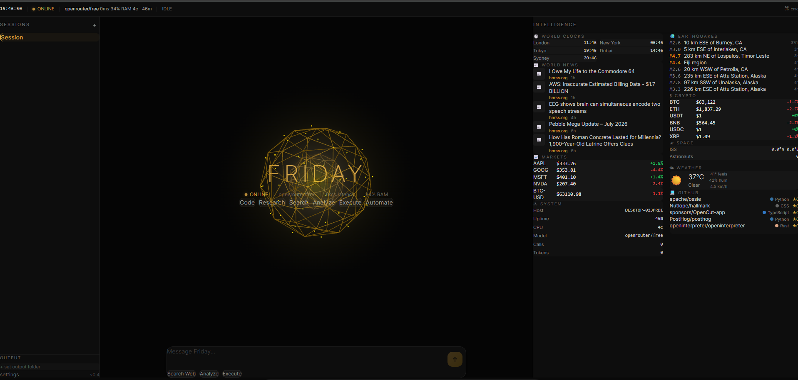

<p align="center">
  
</p>

<h1 align="center">Friday</h1>

<p align="center">
  <strong>AI Command Center — Your Desktop Intelligence Hub</strong>
</p>

<p align="center">
  <a href="#features">Features</a> •
  <a href="#quick-start">Quick Start</a> •
  <a href="#configuration">Configuration</a> •
  <a href="#gesture-controls">Gesture Controls</a> •
  <a href="#project-structure">Project Structure</a>
</p>

<br>

<p align="center">
  
</p>

<br>

## Features

- **Gold Orb AI Core** — Real-time 3D visual state indicator using Three.js; responds to mouse or hand gestures
- **World Monitoring** — Live intelligence panel with earthquakes, crypto, space (ISS), global clocks, CVE security alerts, weather, news, stocks, and GitHub trending
- **Gesture Control** — Webcam-based hand tracking; wave to interact with the orb (open/close fist for scaling, position tracking for movement)
- **Chat Interface** — Streaming AI responses with tool call visualization, plan displays, and session management
- **Command Palette** — ⌘K quick actions for session switching, gesture toggling, and theme changes
- **Status Ribbon** — Compact system bar showing time, model, latency, RAM, CPU cores, uptime, and backend health
- **Sessions Management** — Multiple AI conversations with local persistence and per-session output directories

<br>

## Quick Start

### 1. Clone & install

```bash
# Frontend
cd desktop
npm install

# Backend (Python 3.11+)
pip install quart quart-cors hypercorn yfinance
```

### 2. Start the backend

```bash
python api_server.py
```

> Runs on `http://localhost:8080`. The frontend connects here automatically.

### 3. Add your API key

```bash
cp config/providers.toml.example config/providers.toml
```

Edit `config/providers.toml` and set your `api_key` (get one free at [openrouter.ai/keys](https://openrouter.ai/keys)).

### 4. Start the frontend

```bash
npm run dev
```

> Opens at `http://localhost:5173`. Done.

<br>

<p align="center">
  
  <br>
  <em>— terminal screenshot placeholder —</em>
</p>

<br>

### Build for production

```bash
npm run build
```

Output lands in `dist/`. Serve with any static file server.

<br>

## Configuration

### Environment

| Variable | Default | Description |
|----------|---------|-------------|
| `API_BASE` (in `src/App.tsx`) | `http://localhost:8080` | Backend URL |

### API Keys

Copy the example config and add your keys:

```bash
cp config/providers.toml.example config/providers.toml
```

Then edit `config/providers.toml` and set your API keys:

| Provider | Key needed | Get it at |
|----------|-----------|-----------|
| **OpenRouter** (default) | `api_key` | https://openrouter.ai/keys |
| **OpenAI** | `api_key` | https://platform.openai.com/api-keys |
| **Ollama** (local) | none | Runs on `localhost:11434` |

The file is in `.gitignore` so your keys stay local.

### Backend endpoints (auto-detected)

| Endpoint | Cache | Source |
|----------|-------|--------|
| `/api/health` | — | Backend status |
| `/api/metrics` | — | LLM usage / latency |
| `/api/system-info` | 30s | Host, CPU, Python version |
| `/api/news` | 5m | Hacker News + RSS |
| `/api/weather` | 5m | Open-Meteo |
| `/api/stocks` | 60s | Yahoo Finance |
| `/api/github-trending` | 5m | GitHub scraping |
| `/api/earthquakes` | 2m | USGS |
| `/api/crypto` | 2m | CoinGecko |
| `/api/space` | 60s | Open Notify (ISS + astronauts) |
| `/api/global-time` | 10s | ZoneInfo |
| `/api/cve` | 10m | NVD |

Weather location defaults to Islamabad. Override with `?lat=...&lon=...&location=...`.

<br>

## Gesture Controls

Enable camera from the command palette (`⌘K` → *Gesture control*) or the camera indicator button.

| Gesture | Effect |
|---------|--------|
| Open hand (palm) | Orb expands |
| Closed fist | Orb contracts |
| Move hand left/right | Orb follows horizontally |
| Move hand up/down | Orb follows vertically |

The orb floats behind the UI on a full-canvas Three.js scene — no clipping box.

<br>

## Project Structure

```
desktop/
├── api_server.py            # Python backend (Quart + Hypercorn)
├── src/
│   ├── App.tsx              # Root layout, data fetching, orchestrator
│   ├── main.tsx             # Vite entry point
│   ├── index.css            # Global styles + Tailwind v4
│   ├── components/
│   │   ├── center/
│   │   │   └── AiCore.tsx   # Gold Three.js orb + FRIDAY branding + command cards
│   │   ├── sidebar/
│   │   │   ├── LeftSidebar.tsx        # Session list + output dir
│   │   │   └── IntelligencePanel.tsx  # 640px, 2-column world monitoring
│   │   ├── chat/
│   │   │   ├── InputBar.tsx           # Message input (gold focus)
│   │   │   ├── MessageBubble.tsx      # Streaming messages + tool calls
│   │   │   ├── QuickActions.tsx       # Quick prompt chips
│   │   │   └── TypingIndicator.tsx    # Animated dots
│   │   ├── topbar/
│   │   │   └── TopBar.tsx             # Status ribbon (h-9, compact)
│   │   ├── command/
│   │   │   └── CommandPalette.tsx     # ⌘K command menu
│   │   └── common/
│   │       ├── CameraIndicator.tsx    # Webcam feed overlay + openness
│   │       └── Skeleton.tsx           # Shimmer loading placeholders
│   ├── core/
│   │   ├── StateManager.ts   # Central state (sessions, orb, metrics)
│   │   ├── ThemeEngine.ts    # Dark/light mode (CSS variables)
│   │   └── EventBus.ts       # Pub/sub for cross-component events
│   ├── hooks/
│   │   ├── useCamera.ts      # getUserMedia wrapper
│   │   └── useHandGesture.ts # Skin-detection hand tracker
│   └── types/
│       └── index.ts          # All TypeScript types + WEATHER_CODES
└── package.json
```

<br>

## Screenshots

<p align="center">
  
  
  <br>
  
  
  <br>
  <em>— replace placeholder SVGs with actual screenshots —</em>
</p>

<br>

## Tech Stack

| Layer | Technology |
|-------|-----------|
| **Frontend** | React 19, TypeScript 6, Vite 8 |
| **Styling** | Tailwind CSS v4 |
| **3D** | Three.js 0.185 |
| **Backend** | Python 3.11+, Quart, Hypercorn |
| **LLM** | OpenRouter / any OpenAI-compatible API |

<br>

## License

MIT
