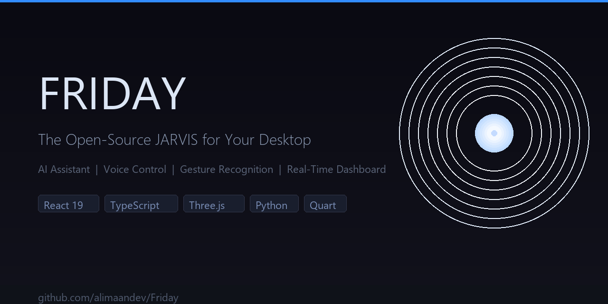
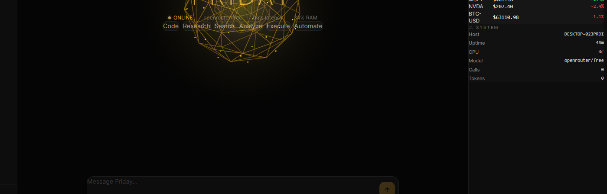
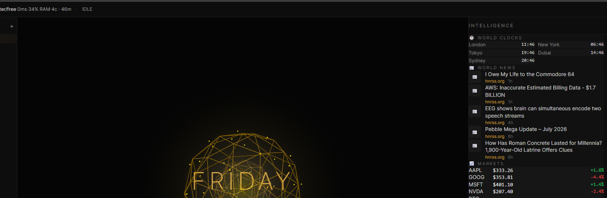
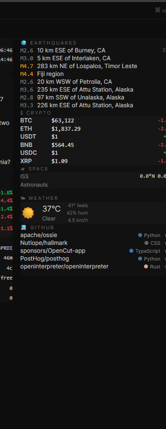
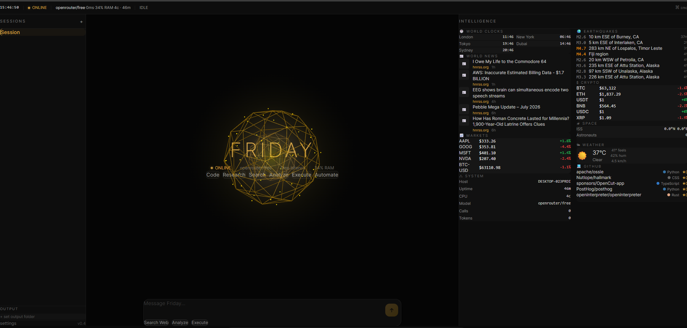

<div align="center">
  <a name="readme-top"></a>

  

  <br><br>

  <h1 align="center">Friday — The Open-Source JARVIS for Your Desktop</h1>

  <p align="center">
    Speak, gesture, or type — your AI command center runs on <strong>your machine</strong>.<br>
    No cloud lock-in. No subscriptions. Your data, your rules.
  </p>

  <br>

  <!-- SHIELD GROUP -->
  <p align="center">
    <a href="https://github.com/alimaandev/Friday/stargazers"></a>
    <a href="https://github.com/alimaandev/Friday/issues"></a>
    <a href="https://github.com/alimaandev/Friday/actions"></a>
    <a href="https://github.com/alimaandev/Friday/blob/main/LICENSE"></a>
    <br>
    <a href="https://react.dev"></a>
    <a href="https://threejs.org"></a>
    <a href="https://www.python.org"></a>
    <a href="https://vite.dev"></a>
    <a href="https://tailwindcss.com"></a>
    <a href="https://www.typescriptlang.org"></a>
    <a href="https://github.com/sponsors/alimaandev"></a>
  </p>
</div>

<br>

<details>
  <summary><kbd>📖 Table of Contents</kbd></summary>

  - [⚡ Quick Start](#-quick-start)
  - [✨ What is Friday?](#-what-is-friday)
  - [🚀 Features](#-features)
    - [🧠 AI Core](#-ai-core)
    - [🎨 3D Reactive Orb](#-3d-reactive-orb)
    - [🌍 Live Intelligence Panel](#-live-intelligence-panel)
    - [🎤 Voice & Gesture](#-voice--gesture)
    - [🔌 Integrations](#-integrations)
  - [🖥 Demo](#-demo)
  - [🏗 Architecture](#-architecture)
  - [🛣 Roadmap](#-roadmap)
  - [🧪 Tests](#-tests)
  - [🤝 Contributing](#-contributing)
  - [⭐ Star History](#-star-history)
  - [💖 Support](#-support)
  - [📄 License](#-license)

</details>

<br>

---

## ⚡ Quick Start

### 🐳 Docker (recommended)

```bash
git clone https://github.com/alimaandev/Friday.git
cd Friday
cp config/providers.toml.example config/providers.toml
# Edit config/providers.toml — paste your OpenRouter API key
docker compose up -d
```

Frontend → `http://localhost:5173` · Backend → `http://localhost:8080`

### 🔧 Manual setup

```bash
# 1. Clone
git clone https://github.com/alimaandev/Friday.git
cd Friday

# 2. Backend
pip install -r requirements.txt
cp config/providers.toml.example config/providers.toml
# Edit config/providers.toml — paste your API key
cd desktop && python api_server.py &
# Backend → http://localhost:8080

# 3. Frontend
npm install
npm run dev
# Frontend → http://localhost:5173
```

That's it. The orb pulses, the panel fills with live data, and Friday is online.

<div align="right">
  <a href="#readme-top">▲ back to top</a>
</div>

<br>

---

## ✨ What is Friday?

**Friday** turns your desktop into an AI command center — inspired by the JARVIS interface from Iron Man. It's a fully open-source, real-time dashboard that combines:

- A **3D reactive orb** that shifts form based on what Friday is doing
- A **live intelligence panel** with 10 data modules (news, weather, stocks, crypto, space, earthquakes, CVE, GitHub trending, world clocks, alerts)
- **Voice input/output** with wake-word detection ("Hey Friday")
- **Webcam hand-gesture control** — open palm to speak, fist to send
- **Google Calendar & Gmail** integration via OAuth 2.0
- **Streaming chat** backed by any OpenAI-compatible LLM (OpenRouter, OpenAI, Ollama, or custom)

Everything runs locally. Your API key, your LLM, your choice.

**v2** delivered async performance — SSE push replaced 18 polling loops, lazy loading, batched memory persistence, and bounded caching. The result is a responsive, production-grade desktop AI experience.

<div align="right">
  <a href="#readme-top">▲ back to top</a>
</div>

<br>

---

## 🚀 Features

### 🧠 AI Core

<p align="center">
  
  <br>
  <em>Streaming chat with token-by-token responses, session management, and suggestion chips</em>
</p>

| Capability | Details |
|-----------|---------|
| **Streaming Chat** | Token-by-token responses with plan visualization and tool-call tracking |
| **Multi-Session** | Create, switch, and delete conversations — each with independent memory |
| **Command Palette** | `⌘K` / `Ctrl+K` for instant actions: new session, toggle voice, camera, wake word |
| **Suggestion Chips** | Context-aware one-click prompts: *Explain*, *Search*, *Code*, *Summarize* |

<div align="right">
  <a href="#readme-top">▲ back to top</a>
</div>

<br>

### 🎨 3D Reactive Orb

<p align="center">
  
  <br>
  <em>The procedural Three.js orb at the heart of Friday's interface — 10 state-driven animation profiles</em>
</p>

| State | Visual |
|-------|--------|
| Idle | Slow pulse, dim glow |
| Listening | Quick ring pulse, brighter core |
| Thinking | Fast wave pattern, high glow |
| Reasoning | Concentric ring expansion |
| Speaking | Rapid fire rings, bright center |
| Error → Thinking | Falls back to thinking config |
| Offline | Faint pulse, minimal glow |

Additional effects: hand-tracking follow (orb follows your cursor when camera is active), auto-pause (rAF loop halts on tab hide), noise-based energy core, Fresnel glow, holographic hex shell, orbital rings, drifting particles.

<div align="right">
  <a href="#readme-top">▲ back to top</a>
</div>

<br>

### 🌍 Live Intelligence Panel

<p align="center">
  
  <br>
  <em>10 live data modules pushing real-time updates via SSE — news, weather, stocks, crypto, space, and more</em>
</p>

| Module | Source | Refresh | Description |
|--------|--------|---------|-------------|
| 📰 News | Hacker News + RSS | 5 min | Global tech headlines |
| 🌤 Weather | Open-Meteo | 5 min | Current conditions + forecast |
| 📈 Stocks | Yahoo Finance | 60 s | AAPL, GOOG, MSFT, NVDA, BTC-USD |
| 💻 GitHub Trending | GitHub API | 5 min | Trending repos |
| 🌋 Earthquakes | USGS API | 2 min | Recent seismic events |
| ₿ Crypto | CoinGecko | 2 min | Top crypto prices |
| 🛰 Space | Open Notify | 60 s | ISS location + astronauts |
| 🕐 World Clocks | — | 30 s | London, NY, Tokyo, Dubai, Sydney |
| 🔐 CVE | NVD Feed | 10 min | Security vulnerabilities |

All data pushes via **SSE** — a single EventSource connection replaces 18 polling loops.

<div align="right">
  <a href="#readme-top">▲ back to top</a>
</div>

<br>

### 🎤 Voice & Gesture

| Feature | How it works |
|---------|-------------|
| **Voice Input** | Hold mic → speak → release. Browser SpeechRecognition. |
| **Voice Output** | TTS reads assistant responses aloud |
| **Wake Word** | "Hey Friday" activates listening (offline, in-browser) |
| **Hand Gestures** | ✋ Open palm = listen · ✊ Fist = send · 👆 Move = orb follow |
| **Multi-Language** | Cycle English / Hindi / Urdu via mic-lang button |

Enable the camera from the command palette (`⌘K` → *Gesture control*) or the camera button in the status ribbon. The orb reacts to your hand position in real time — no external sensors needed.

<div align="right">
  <a href="#readme-top">▲ back to top</a>
</div>

<br>

### 🔌 Integrations

| Integration | Type | Details |
|-------------|------|---------|
| **Google Calendar** | OAuth 2.0 | View upcoming events inline |
| **Gmail** | OAuth 2.0 | Unread count + inbox preview |
| **Screen Capture** | Periodic | Desktop screenshots inside the panel |
| **Memory** | TF-IDF + Jaccard + Vector | Cross-session semantic search |
| **Proactive Alerts** | SSE | System anomalies, reminders, notifications |
| **LLM Providers** | Pluggable | OpenRouter, OpenAI, Ollama, custom OpenAI-compatible |

<div align="right">
  <a href="#readme-top">▲ back to top</a>
</div>

<br>

---

## 🖥 Demo

> 🎥 *A demo GIF will go here. Capture a 15-second screen recording (orb + voice command + intelligence panel), convert via [ScreenToGif](https://www.screentogif.com/), and embed below.*

<p align="center">
  
  <br>
  <em>Live intelligence panel in action</em>
</p>

<div align="right">
  <a href="#readme-top">▲ back to top</a>
</div>

<br>

---

## 🏗 Architecture

```
┌─────────────────────────────────────────────────────┐
│                   Browser (React)                    │
│  ┌──────────┐  ┌──────────────┐  ┌───────────────┐  │
│  │  AiCore   │  │ Intelligence │  │    Chat       │  │
│  │ (Three.js)│  │   Panel      │  │  (Streaming)  │  │
│  └────┬─────┘  └──────┬───────┘  └──────┬────────┘  │
│       │               │                 │            │
│       └───────────────┼─────────────────┘            │
│                       │ SSE EventSource              │
│          ┌────────────┴────────────┐                 │
│          │   EventBroadcaster      │                 │
│          └────────────┬────────────┘                 │
└───────────────────────┼─────────────────────────────┘
                        │ HTTP / SSE
┌───────────────────────┼─────────────────────────────┐
│              Python Backend (Quart)                  │
│  ┌──────────┐  ┌──────────────┐  ┌───────────────┐  │
│  │  Routes   │  │    Agents    │  │    Memory     │  │
│  │ /api/v1/* │  │  (ThreadPool)│  │ (3 engines)   │  │
│  └────┬─────┘  └──────┬───────┘  └──────┬────────┘  │
│       │               │                 │            │
│  ┌────┴────────────────┴─────────────────┴────────┐  │
│  │         httpx.AsyncClient (pooled)              │  │
│  └─────────────────────────────────────────────────┘  │
└───────────────────────┬─────────────────────────────┘
                        │ API calls
              ┌─────────┴──────────┐
              │  LLM (OpenRouter / │
              │  OpenAI / Ollama)  │
              └────────────────────┘
```

<div align="right">
  <a href="#readme-top">▲ back to top</a>
</div>

<br>

---

## 🛣 Roadmap

| Release | Status | Highlights |
|---------|--------|------------|
| **v1** | ✅ Shipped | Core chat, 3D orb, intelligence dashboard |
| **v2** | ✅ Shipped | Async backend, SSE push, voice/gesture, Google integration, performance overhaul |
| **v3** | 🔨 In progress | Plugin marketplace, custom tool builder, local RAG pipeline |
| **v4** | 📋 Planned | Mobile companion app, multi-user mode, proactive automation engine |
| **v5** | 📋 Planned | Native desktop app (Tauri), offline-first, local LLM integration |

Track progress on the [open issues](https://github.com/alimaandev/Friday/issues).

<div align="right">
  <a href="#readme-top">▲ back to top</a>
</div>

<br>

---

## 🧪 Tests

```bash
python -m pytest tests/ -v
```

59 tests covering memory, security sandbox, rate limiter, planner, plugin registry, logger, and long-term memory decay.

The CI pipeline runs every push — see [Actions](https://github.com/alimaandev/Friday/actions) for status.

<div align="right">
  <a href="#readme-top">▲ back to top</a>
</div>

<br>

---

## 🤝 Contributing

We welcome contributions of all sizes — from typo fixes to new features.

1. Fork the repo
2. Create your feature branch (`git checkout -b feat/amazing`)
3. Commit your changes (`git commit -m 'feat: add amazing feature'`)
4. Push (`git push origin feat/amazing`)
5. Open a Pull Request

Check out [open issues](https://github.com/alimaandev/Friday/issues) — especially ones labelled [`good first issue`](https://github.com/alimaandev/Friday/labels/good%20first%20issue) — to find something to work on.

<a href="https://github.com/alimaandev/Friday/graphs/contributors">
  
</a>

<div align="right">
  <a href="#readme-top">▲ back to top</a>
</div>

<br>

---

## ⭐ Star History

<a href="https://star-history.com/#alimaandev/Friday&Date">
  <picture>
    <source media="(prefers-color-scheme: dark)" srcset="https://www.star-history.com/svg?repos=alimaandev/Friday&type=Date&theme=dark">
    
  </picture>
</a>

<br>

### Share Friday

<p align="center">
  <a href="https://twitter.com/intent/tweet?text=Check%20out%20Friday%20-%20The%20Open-Source%20JARVIS%20for%20Your%20Desktop%20%F0%9F%9A%80&url=https://github.com/alimaandev/Friday&hashtags=ai,opensource,react,python">
    
  </a>
  <a href="https://www.reddit.com/submit?title=Friday%20%E2%80%94%20The%20Open-Source%20JARVIS%20for%20Your%20Desktop&url=https://github.com/alimaandev/Friday">
    
  </a>
  <a href="https://www.linkedin.com/sharing/share-offsite/?url=https://github.com/alimaandev/Friday">
    
  </a>
  <a href="https://t.me/share/url?text=Check%20out%20Friday%20-%20The%20Open-Source%20JARVIS%20for%20Your%20Desktop&url=https://github.com/alimaandev/Friday">
    
  </a>
</p>

<div align="right">
  <a href="#readme-top">▲ back to top</a>
</div>

<br>

---

## 💖 Support

If Friday is useful to you, consider supporting the project:

- ⭐ **Star** the repo — it helps others discover it
- 🐛 **Report bugs** or request features via [issues](https://github.com/alimaandev/Friday/issues)
- 🤝 **Contribute** code via [pull requests](https://github.com/alimaandev/Friday/pulls)
- 💰 **Sponsor** via [GitHub Sponsors](https://github.com/sponsors/alimaandev)

<div align="right">
  <a href="#readme-top">▲ back to top</a>
</div>

<br>

---

## 📄 License

MIT — use it, modify it, ship it. See [LICENSE](LICENSE) for details.

<br>

---

<p align="center">
  <sub>Built with ❤️ by <a href="https://github.com/alimaandev">alimaandev</a> · 
  <a href="https://github.com/alimaandev/Friday/discussions">Discussions</a> · 
  <a href="https://github.com/alimaandev/Friday/issues">Issues</a></sub>
</p>

<p align="center">
  <a href="#readme-top">▲ Back to Top ▲</a>
</p>